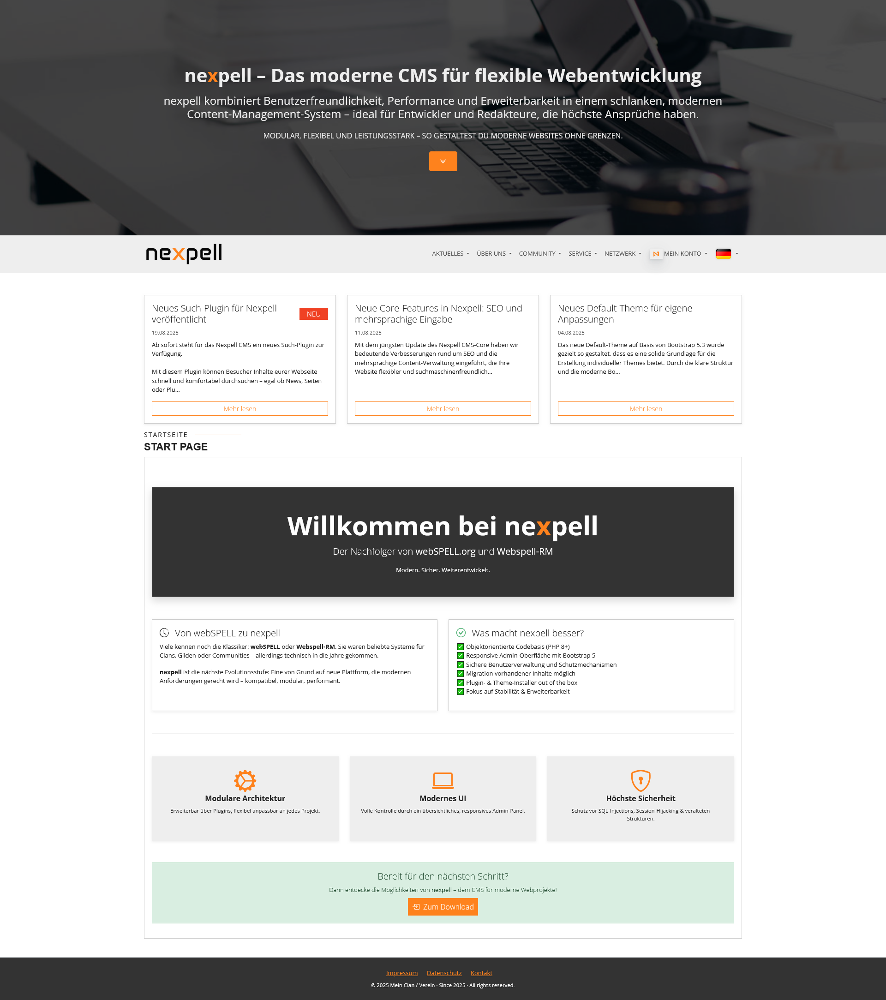

# nexpell 1.0 – Next Generation CMS (2025)

**nexpell** ist ein vollständig neu entwickeltes, modulares und sicheres Open-Source CMS für Communities, Clans und Teams – bereit für das Jahr 2025 und darüber hinaus.

[](https://www.php.net/)
[](LICENSE.md)
[](https://github.com/nexpell/nexpell/actions)
[](https://www.nexpell.de/de/download)

---


<!-- Logo -->
<p align="center">
  
</p>


<!-- Screenshot -->
<p align="center">
  
</p>

<!-- Buttons -->
<p align="center">
  <a href="https://www.nexpell.de" target="_blank" style="background:#4CAF50;color:white;padding:8px 16px;text-decoration:none;border-radius:4px;margin:2px;">Offizielle Website</a>
  <a href="https://www.nexpell.de/de/forum" target="_blank" style="background:#2196F3;color:white;padding:8px 16px;text-decoration:none;border-radius:4px;margin:2px;">Forum & Support</a>
  <a href="https://www.nexpell.de/de/wiki" target="_blank" style="background:#FF9800;color:white;padding:8px 16px;text-decoration:none;border-radius:4px;margin:2px;">Dokumentation</a>
</p>

---

## 🚀 Highlights

- ✅ Installer-basiertes Setup *(1 Datei – alles drin!)*
- 🔌 Erweiterbares Plugin-System
- 🎨 Moderne Themes mit Bootstrap 5
- 🌍 Multilingual durch Sprachdateien
- 🔐 DSGVO-konform & reCAPTCHA
- 🛡️ Schutz vor CSRF, XSS & IP-Missbrauch
- 📈 Statistiken, Admincenter 2.0, Rollen & Rechte
- 📱 100 % Responsive Design (Frontend & Admin)
- 📦 PHP 8.x Unterstützung & saubere OOP-Struktur

---

## 📥 Installation in 6 Schritten

Die Installation erfolgt **ausschließlich über den neuen Web-Installer**, der alle Systemdateien und SQL-Strukturen automatisch einrichtet.

### 🔧 Voraussetzungen

- PHP **≥ 8.1**
- MySQL **8** oder MariaDB **≥ 10.3**
- Schreibrechte für `/config`, `/uploads`, etc.
- Apache/Nginx mit `mod_rewrite` empfohlen

> ⚠️ Wird eine Voraussetzung nicht erfüllt, blockiert der Installer den Vorgang!

### 🛠️ Installationsschritte

1. **Installer herunterladen:**  
   [Download Installer (.php)](https://www.nexpell.de/de/download)

2. **Hochladen:**  
   Lade den Installer auf deinen Webserver (Root-Verzeichnis)

3. **Installer aufrufen:**  
   `https://deinedomain.de/installer.php`

4. **Durch die 6 Schritte folgen:**
   - Serverprüfung
   - Datenbankkonfiguration
   - Systeminstallation
   - Admin-Zugang anlegen
   - Sprache & Einstellungen
   - Cleanup

5. **Fertigstellung:**  
   - CMS wird automatisch installiert
   - DB-Tabellen werden erstellt
   - Setup konfiguriert

6. **Wichtig:**  
   Entferne den `install/`-Ordner nach Abschluss der Installation!

---

## 📂 Systemstruktur

```plaintext
/admin/             → Adminbereich mit modularer Navigation  
/includes/          → Kernfunktionen & Klassen
/includes/module/   → Code Dateien    
/includes/plugins/  → Erweiterbare Plugins  
/includes/themes/   → Frontend-Themes  
/system/            → Template-Engine, Auth, CSRF, Router  
/config/            → Konfigurationen (wird automatisch erstellt)  
/install/           → Nur während des Setups vorhanden 
```

---

## 🧩 Erweiterbarkeit

- Eigene Themes via `/themes/`
- Eigene Plugins via `/plugins/`
- Eigene Module mit Routing und Zugriffskontrolle
- Template-System mit `{platzhalter}`-Syntax
- Saubere OOP-Struktur mit modernem PHP

---

## 📚 Dokumentation & Hilfe

- 📖 [nexpell Wiki](https://www.nexpell.de/de/wiki)  
- 💬 [Forum](https://www.nexpell.de/de/forum)  
- 🐛 Bugs & Feedback: *GitHub Issues (folgt)*

---

## 🤝 Mitwirken

Pull Requests, Bugreports & Feature-Wünsche sind willkommen!  
Bitte halte dich an unseren Beitrag-Guide (folgt demnächst).

---

## 📜 Lizenz

nexpell wird unter der **GNU General Public License v3.0** veröffentlicht.  
© 2025 [nexpell.de](https://www.nexpell.de)
